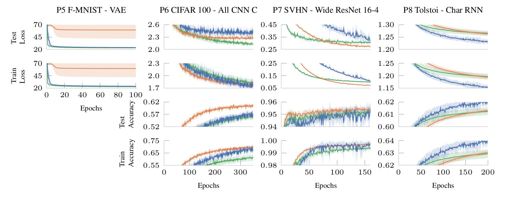
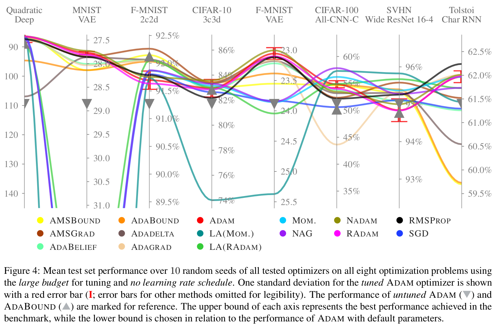

<!-- PROJECT LOGO -->
<br />
<p align="center">
<a href="#"></a>
  <h3 align="center">A Deep Learning Optimizer Benchmark Suite</h3>

  <p align="center">
    Simplifying, automating and improving empirical evaluation of deep learning optimziers.
  </p>
</p>

<p align="center">
  <a href="#installation">Installation</a> •
  <a href="https://deepobs.readthedocs.io/en/new_release">Docs</a> •
  <a href="https://deepobs.readthedocs.io/en/new_release/user_guide/quick_start.html/">User Guide</a> •
  <a href="https://openreview.net/forum?id=rJg6ssC5Y7">Paper</a> •
  <a href="https://deepobs.github.io/#Leaderboard">Leaderboard</a> •
  <a href="https://github.com/SirRob1997/Crowded-Valley---Results">Baselines</a> •
  <a href="#license">License</a> •
  <a href="#citation">Citation</a>
</p>

[](https://github.com/fsschneider/deepobs/actions/workflows/CI.yml)
[](https://github.com/fsschneider/deepobs/actions/workflows/Lint.yml)
[](https://deepobs.readthedocs.io/en/new_release)
[](https://coveralls.io/github/fsschneider/DeepOBS?branch=new_release)
[](https://pypi.org/project/deepobs)
[](https://pepy.tech/project/deepobs)
[](https://github.com/fsschneider/deepobs/blob/master/LICENSE)
[](https://arxiv.org/abs/1903.05499)

---

**DeepOBS is a Python framework for automatically benchmarking deep learning optimizers.** Its goal is to drastically simplify, automate and improve the evaluation of deep learning optimizers. It can:

- evaluate the performance of new optimizers on more than **25 real-world test problems**, such as training Residual Networks for image classification or LSTMs for character prediction.
- automatically compare the results with **realistic baselines** (without having to run them again!)

DeepOBS automates several steps when benchmarking deep learning optimizers:

- Downloading and preparing data sets.
- Setting up test problems consisting of contemporary data sets and realistic deep learning architectures.
- Running the optimizers on multiple test problems and logging relevant metrics.
- Comparing your results to the newest baseline results of other optimizers.
- Reporting and visualizing the results of the optimizer benchmark as ready-to-include ``.tex`` files.

---



<!-- Installation -->
## Installation

To install **DeepOBS** simply run

```bash
pip install deepobs
```

<br>

> To use DeepOBS with PyTorch or TensorFlow, the respective framework needs to be installed. These frameworks are not declared as dependencies because you don't have to install both of them. But you will need at least one of them:
>
> - **TensorFlow:** Both variants, with and without GPU support are viable.
>
> - **PyTorch:** We expect *torchvision* and *torchtext* alongside any *PyTorch* installation.
>
> Besides that, all essential dependencies are automatically installed.

<details>
<summary>Alternatives</summary>
You can also install the latest version directly from source:

```bash
pip install 'git+https://github.com/fsschneider/DeepOBS.git'
```

> If you want to install from one of the branches, use `pip install 'git+https://github.com/fsschneider/DeepOBS.git@{branch}'`. If you want a local and modifiable version of **DeepOBS**, for exmaple, to add custom test problems, add the `-e` option to `pip install`.

</details>

<!-- Documentation -->
## Documentation

The [documentation](https://deepobs.readthedocs.io/en/new_release) provides a full tutorial on how to get started using **DeepOBS** as well as a detailed documentation of its API.

## Leaderboard & Baselines

We keep an [online leaderboard](https://deepobs.github.io/#Leaderboard) for our benchmark sets. All entries in the leaderboard are automatically available for comparisons.

> If you have an optimizer that you believe should be in the leaderboard let us know!


In a separate [paper](https://arxiv.org/abs/2007.01547), we compared fifteen popular deep learning optimizers using **DeepOBS**. You can access all of the results (including the full tuning results) via its [repository](https://github.com/SirRob1997/Crowded-Valley---Results) if you want to use them as baselines for your comparison.



<!-- LICENSE -->
## License

Distributed under the MIT License. See [`LICENSE`](LICENSE) for more information.

<!-- Citation -->
## Citation

If you use **DeepOBS** in your work, we would appreciate a reference to our ICLR paper:

> [Frank Schneider, Lukas Balles, Philipp Hennig<br/>
> **DeepOBS: A Deep Learning Optimizer Benchmark Suite**<br/>
> *ICLR 2019*](https://openreview.net/forum?id=rJg6ssC5Y7)

BibTeX entry:

```bibtex
@InProceedings{schneider2018deepobs,
Title = {Deep{OBS}: A Deep Learning Optimizer Benchmark Suite},
Author = {Frank Schneider and Lukas Balles and Philipp Hennig},
Booktitle = {International Conference on Learning Representations},
Year = {2019},
Url = {https://openreview.net/forum?id=rJg6ssC5Y7}
}
```
