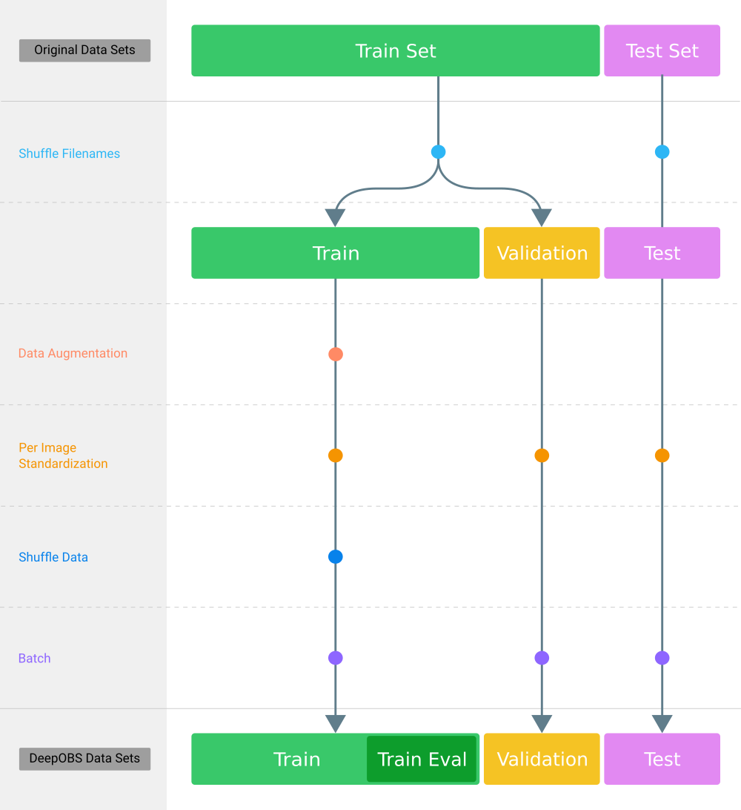

============
Data Sets
============

Currently DeepOBS includes nine different data sets. Each data set inherits from
the same base class with the following signature.

.. currentmodule:: deepobs.tensorflow.datasets.dataset

.. autoclass:: DataSet
    :members:

After selecting a data set (i.e. CIFAR-10, Fahion-MNIST, etc.) we define four internal TensorFlow data sets (i.e. `train`, `train_eval`, `valid` and `test`).
Those are splits of the original data set that are used for training, hyperparameter tuning and performance evaluation.
These internal data sets (also called DeepOBS data sets) are created as shown in the illustration below.

.. toctree::
  :maxdepth: 2
  :caption: Data Sets

  datasets/two_d
  datasets/quadratic
  datasets/mnist
  datasets/fmnist
  datasets/cifar10
  datasets/cifar100
  datasets/svhn
  datasets/imagenet
  datasets/tolstoi
