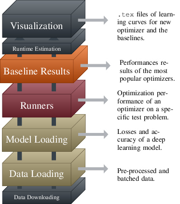
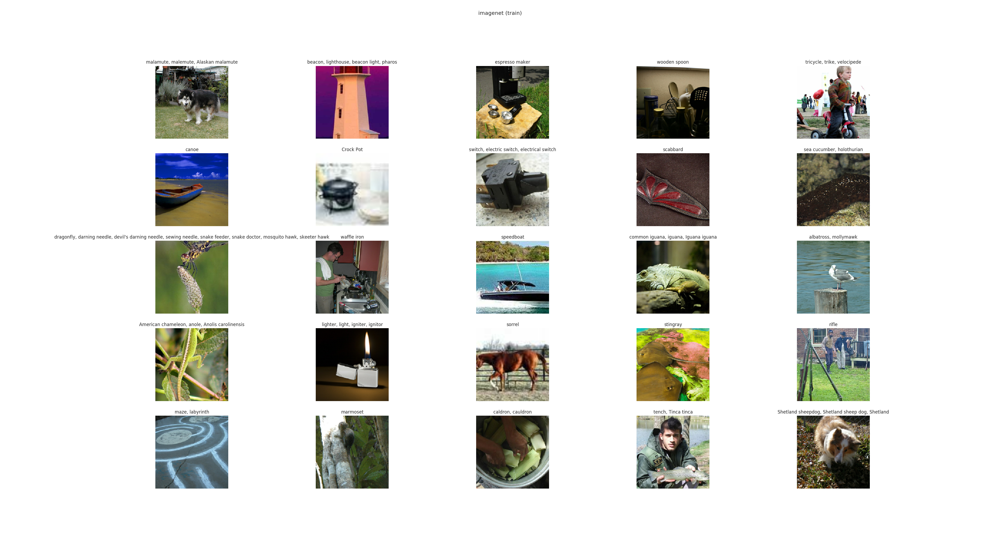

========
Overview
========

DeepOBS provides modules and scripts for the full stack required to rapidly,
reliably and reproducibly benchmark deep learning optimizers.

Here we briefly described the different levels of automation that DeepOBS
provides. While, they are built hierarchically, they can be used separately.
For example, one can use just the data loading capabilities of DeepOBS and built
a new test problem on top of it.

A more detailed description of the modules and scripts can be found in the API
reference section.

Data Downloading
================

DeepOBS can automatically download and pre-process all necessary data sets.
This includes

  - `MNIST <http://yann.lecun.com/exdb/mnist/>`_
  - `Fashion-MNIST (FMNIST)\
    <https://github.com/zalandoresearch/fashion-mnist>`_
  - `CIFAR-10\
    <https://www.cs.toronto.edu/~kriz/cifar.html>`_
  - `CIFAR-100\
    <https://www.cs.toronto.edu/~kriz/cifar.html>`_
  - `Street View House Numbers (SVHN)\
    <http://ufldl.stanford.edu/housenumbers/>`_
  - Leo Tolstoi's War and Peace

  .. NOTE::

    While `ImageNet <http://www.image-net.org/>`_ is part of DeepOBS, it is
    currently not part of the automatic data downloading pipeline mechanic.
    Downloading the `ImageNet` data set requires an account and can take a lot
    of time to download. Additonally, it requires quite a large amount of memory.
    The best way currently is to download and preprocess the `ImageNet` data set
    separately if needed and move it into the DeepOBS data folder.

The automatic data preparation script can be run using

.. code-block:: bash

  deepobs_prepare_data.sh

and is described in the API section under
:doc:`../api/scripts/deepobs_prepare_data`.

Data Loading
============

The DeepOBS data loading module then performs all necessary processing of the
data sets to return inputs and outputs for the deep learning model (e.g. images
and labels for image classification). This processing includes splitting,
shuffling, batching and data augmentation. The data loading module can also be
used to build new deep learning models that are not (yet) part of DeepOBS.

The outputs of the data loading module is illustrated in the figure below and is
further described in the API section under :doc:`../api/datasets`.

Model Loading
=============

Together, data set and model define a loss function and thus an optimization
problem. We selected problems for diversity of task as well as the difficulty of
the optimization problem itself. The list of test problems of DeepOBS includes
popular image classification models on data sets like ``MNIST``, ``CIFAR-10`` or
``ImageNet``, but also models for natural language processing and generative
models.

Additionally, three two-dimensional problems and an ill-conditioned quadratic
problem are included. These simple tests can be used as illustrative toy
problems to highlight properties of an algorithm and perform sanity-checks.

Over time, we plan to expand this list when hardware and research progress
renders small problems out of date, and introduces new research directions and
more challenging problems.

The implementation of the models is described in the API section under
:doc:`../api/testproblems`.

Runners
=======

The runners of the DeepOBS package handle training and the logging of statistics
measuring the optimizer's performance. For optimizers following the standard
TensorFlow optimizer API it is enough to provide the runners with a list of the
optimizer’s hyperparameters. We provide a template for this, as well as an
example of including a more sophisticated optimizer that can’t be described as
a subclass of the TensorFlow optimizer API.

In the API section, we described the :doc:`../api/runner/standardrunner` and in
the :doc:`tutorial` we show an example of creating a run script for a new
optimizer.

Baseline Results
================

DeepOBS also provides realistic baselines results for, currently, the three most
popular optimizers in deep learning, ``SGD``, ``Momentum``, and ``Adam``.
These allow comparing a newly developed algorithm to the competition without
computational overhead, and without risk of conscious or unconscious bias
against the competition.

Baselines for further optimizers will be added when authors provide the
optimizer’s code, assuming the method perform competitively. Currently,
baselines are available for all test problems in the small and large benchmark
set.

The baselines can be downloaded automatically by running

.. code-block:: bash

  deepobs_get_baselines.sh

and the script is described in the API section under
:doc:`../api/scripts/deepobs_get_baselines`.

Runtime Estimation
==================

DeepOBS provides an option to quickly estimate the runtime overhead of a new
optimization method compared to ``SGD``. It measures the ratio of wall-clock
time between the new optimizer and ``SGD``.

By default this ratio is measured on five runs each, for three epochs, on a
fully connected network on ``MNIST``. However, this can be adapted to a setting
which fairly evaluates the new optimizer, as some optimizers might have a high
initial cost that amortizes over many epochs.

The :doc:`../api/scripts/deepobs_estimate_runtime` script is described in the
API section.

Visualization
=============

The DeepOBS visualization module reduces the overhead for the preparation of
results, and simultaneously standardizes the presentation, making it possible to
include a comparably large amount of information in limited space.

The module produces .tex files with pgfplots-code for all learning curves for
the proposed optimizer as well as the most relevant baselines. This also
includes a plot showing the ``learning rate`` sensitivity. An example plot is
shown below, a more comprehensive example can be seen in section 4 of the
`DeepOBS`_ paper.

.. _DeepOBS: https://openreview.net/forum?id=rJg6ssC5Y7

.. image:: ../deepobs.jpg
    :scale: 40%

The :doc:`../api/scripts/deepobs_plot_results` script is described in the
API section, as well as the lower-level functions it is relying on.
