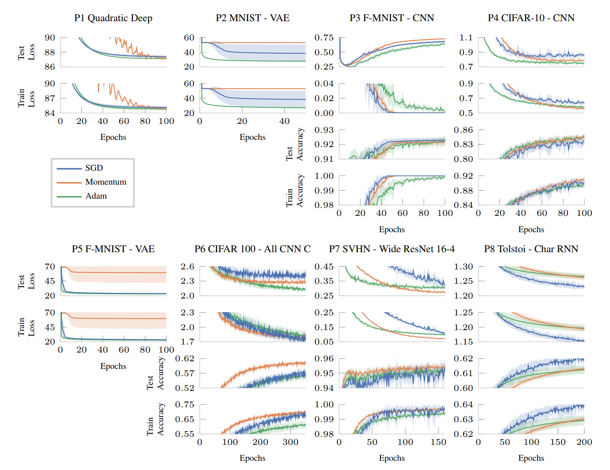
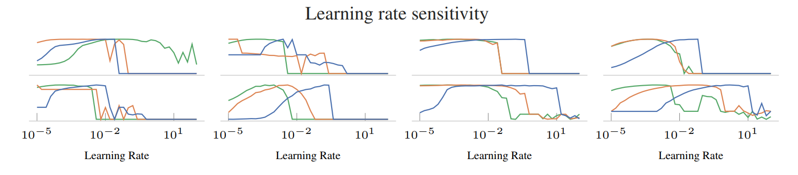
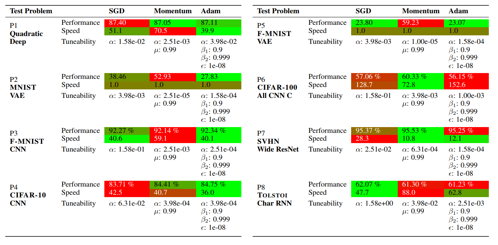

==================
Suggested Protocol
==================

Here we provide a suggested protocol for more rigorously benchmarking deep
learning optimizers. It follows the same steps as the baseline results presented
in the `DeepOBS`_ paper.

.. _DeepOBS: https://openreview.net/forum?id=rJg6ssC5Y7

Create new Run Script
=====================

In order to benchmark a new optimization method a new run script has to be
written. A more detailed description can be found in the :doc:`tutorial` and
the the API section for the :doc:`../api/runner/standardrunner`, but all is
needed is the optimizer itself and a list of its hyperparameters. For example
for the Momentum optimizer this will be.

.. code-block:: python3
  :linenos:

  import tensorflow as tf
  import deepobs.tensorflow as tfobs

  optimizer_class = tf.train.MomentumOptimizer
  hyperparams = [{"name": "momentum", "type": float},
                 {"name": "use_nesterov", "type": bool, "default": False }]
  runner = tfobs.runners.StandardRunner(optimizer_class, hyperparams)

  runner.run(train_log_interval=10)

Hyperparameter Search
=====================

Once the optimizer has been defined it is recommended to do a hyperparameter
search for each test problem. For optimizers with only the ``learning rate`` as
a free parameter a simple grid search can be done.

For the baselines, we tuned the ``learning rate`` for each optimizer and test
problem individually, by evaluating on a logarithmic grid from ``10e−5``
to ``10e2`` with ``36`` samples. If the same tuning method is used for a new
optimizer no re-running of the baselines is needed saving valuable
computational budget.

Repeated Runs with best Setting
===============================

In order to get a sense of the optimizer's consistency, we suggest repeating
runs with the best hyperparameter setting multiple times. This allows an
assessment of the variance of the optimizer's performance.

For the baselines we determined the best learning rate looking at the final
performance of each run, which can be done using

.. code-block:: bash

  deepobs_plot_results results/ --get_best_run

and then running the best performing setting again using ten different random
seeds.

Plot Results
============

To visualize the final results it is sufficient to run

.. code-block:: bash

  deepobs_plot_results results/ --full

This will show the performance plots for the ``small`` and ``large`` benchmark
set

as well as the learning rate sensitivity plot

and the overall performance table

If the path to the baseline folder is given, DeepOBS will automatically compare
the results with the baselines for ``SGD``, ``Momentum``, and ``Adam``.

For all plots, ``.tex`` files will be generated with pgfplots-code for direct
inclusion in academic publications.
