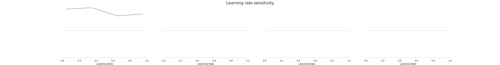
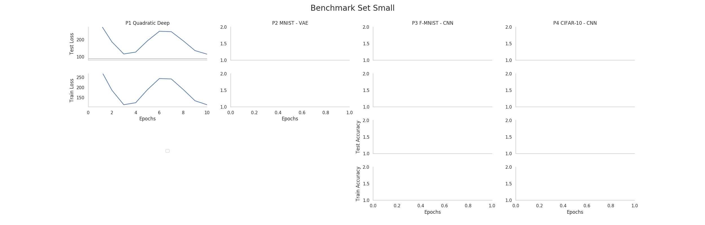

==============
Simple Example
==============

This tutorial will show you an example of how DeepOBS can be used to benchmark
the performance of a new optimization method for deep learning.

This simple example aims to show you some basic functions of DeepOBS, by
creating a run script for a new optimizer (we will use the Momentum optimizer
as an example here) and running it on a very simple test problem.

Create new Run Script
=====================

The easiest way to use DeepOBS with a new optimizer is to write a run script for
it. This run script will import the optimizer and list its hyperparameters
(other than the ``learning rate``). For the Momentum optimizer this is simply

.. code-block:: python3
  :linenos:
  :name: momentum_runner.py
  :caption: momentum_runner.py

  import tensorflow as tf
  import deepobs.tensorflow as tfobs

  optimizer_class = tf.train.MomentumOptimizer
  hyperparams = [{"name": "momentum", "type": float},
                 {"name": "use_nesterov", "type": bool, "default": False }]
  runner = tfobs.runners.StandardRunner(optimizer_class, hyperparams)

  # The run method accepts all the relevant inputs, all arguments that are not
  # provided will automatically be grabbed from the command line.
  runner.run(train_log_interval=10)

You can download this :download:`example run script\
<../../example_momentum_runner.py>` and use it as a template.

The DeepOBS runner (Line 7) needs access to an optimizer class with the same API
as the TensorFlow optimizers and a list of additional hyperparameters for this
new optimizers.

This run script is now fully command line based and is able to access all the
test problems (and other options) of DeepOBS while also allowing to specify the
new optimizers hyperparameters.

Run new Optimizer
=================

Assuming the run script (from the previous section) is called
``momentum_runner.py`` we can use it to run the Momentum optimizer on one of the
test problems on DeepOBS:

.. code-block:: bash

  python momentum_runner.py quadratic_deep --bs 128 --lr 1e-2 --momentum 0.99 --num_epochs 10

We will run it a couple times more this time with different ``learning_rates``

.. code-block:: bash

  python momentum_runner.py quadratic_deep --bs 128 --lr 1e-3 --momentum 0.99 --num_epochs 10
  python momentum_runner.py quadratic_deep --bs 128 --lr 1e-4 --momentum 0.99 --num_epochs 10
  python momentum_runner.py quadratic_deep --bs 128 --lr 1e-5 --momentum 0.99 --num_epochs 10

Get best Run
============

We can use DeepOBS to automatically find the best of the hyperparameter
settings.

In this example we will directly access the (lower-level) functions of DeepOBS.
In the section :doc:`suggested_protocol` we show you how to use the convenience
scripts to do the following steps automatically.

.. code-block:: python3

  import deepobs

  analyzer = deepobs.analyzer.analyze_utils.Analyzer("results")
  deepobs.analyzer.analyze.get_best_run(analyzer)

Since all of our results from the previous section are stored in the ``results``
folder, we pass this path to the DeepOBS :doc:`../api/analyzer/analyzer`. Next,
we can call the ``get_best_run`` function with this analyzer and get an output
like this

.. code-block:: console

  ***********************
  Analyzing quadratic_deep
  ***********************
  Checked 4 settings for MomentumOptimizer and found the following
  Best Setting (Final Value) num_epochs__10__batch_size__10__momentum__9.9e-01__use_nesterov__False__lr__1.e-04 with final performance of 115.23509434291294
  Best Setting (Best Value) num_epochs__10__batch_size__10__momentum__9.9e-01__use_nesterov__False__lr__1.e-03 with best performance of 111.36394282749721

Plot Results
============

Similarly, we can plot the sensitivity of the (final) performance with regard to
the ``learning rate`` by calling the appropriate DeepOBS function

.. code-block:: python3

  deepobs.analyzer.analyze.plot_lr_sensitivity(analyzer)

and getting a plot like this

And most importantly, a performance plot of the best performing hyperparameter
setting (when looking at the final performance)

.. code-block:: python3

  deepobs.analyzer.analyze.plot_performance(analyzer, mode='final')

